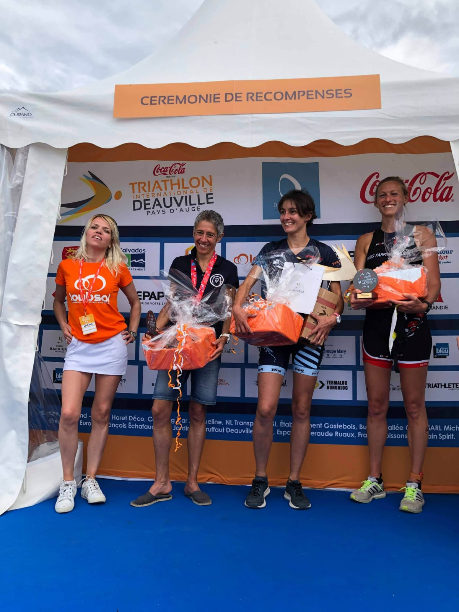

They can't fathom the concept that my life doesn't revolve around you. I am strong and I am comfortable with being strong. He doesn't love me. But here's the thing: I love me. So I'm done. America can forgive a man one hundred infidelities, but they will never forgive a woman even one.

If she was a man, you'd say she was formidable, or bold, or right. Screw beautiful. I'm brilliant! You want to appease me, compliment my brain! I am fine dancing alone. Never give in. Never give up. Stand up. Stand up and take it.

Another thing I just don't do anymore is wax. So it's 1976 down there. I'm not deranged; I'm just divorced. You have to hold on to what you want. You have to not take "No' for an answer, and take what’s coming to you. America can forgive a man one hundred infidelities, but they will never forgive a woman even one.

It's handled. So I'm bisexual. So what? It's a thing and it's real. I want painful, devastating, life-changing, extraordinary love. I am not a fantasy. If you want me, earn me.

I am strong and I am comfortable with being strong. Maybe the struggle, the climb, one obstacle after another… maybe that's just life. I am many things; stupid is not one of them. Don't let what he wants eclipse what you need.
